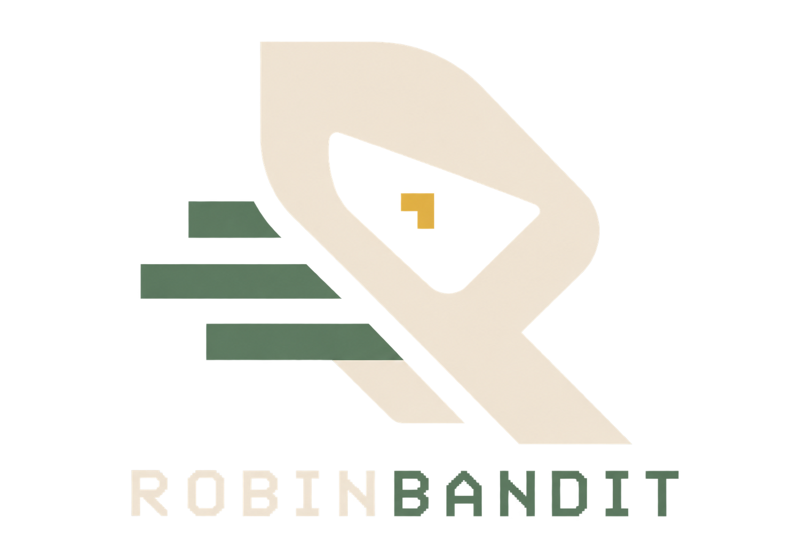
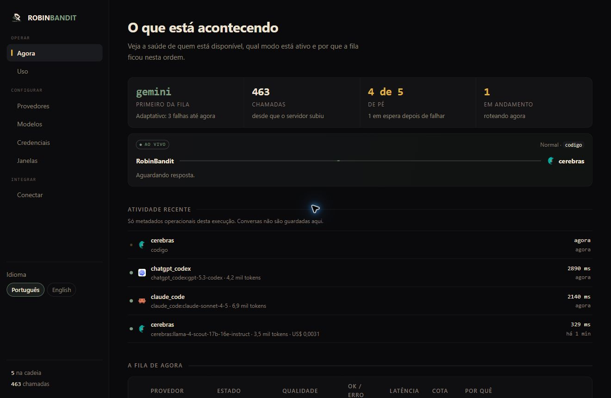
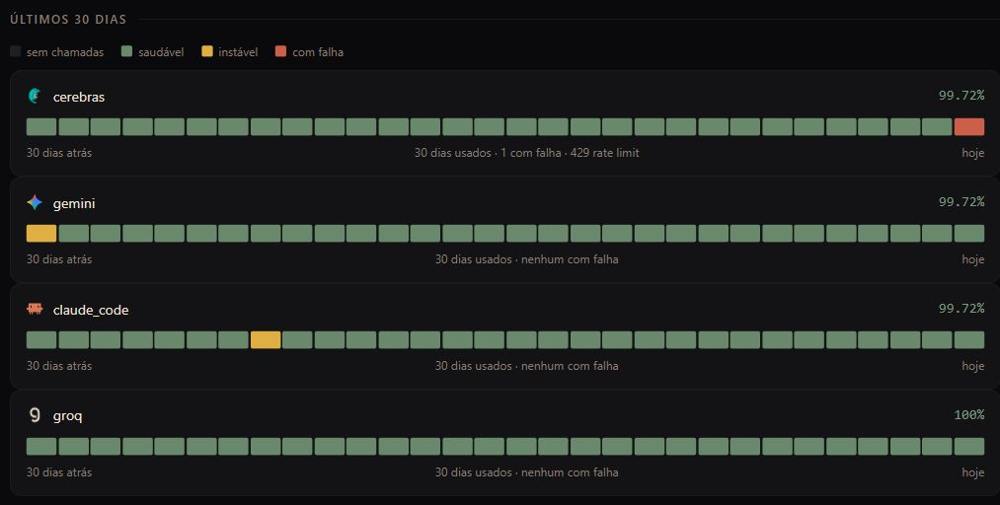
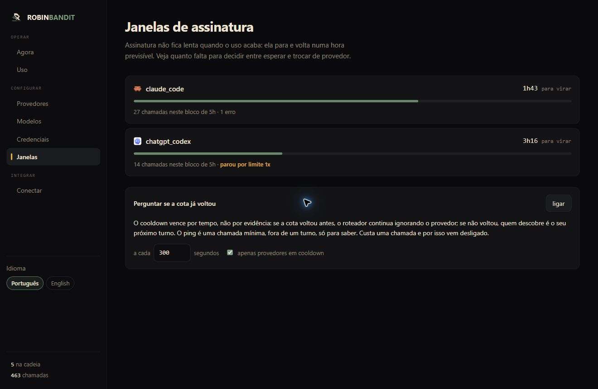
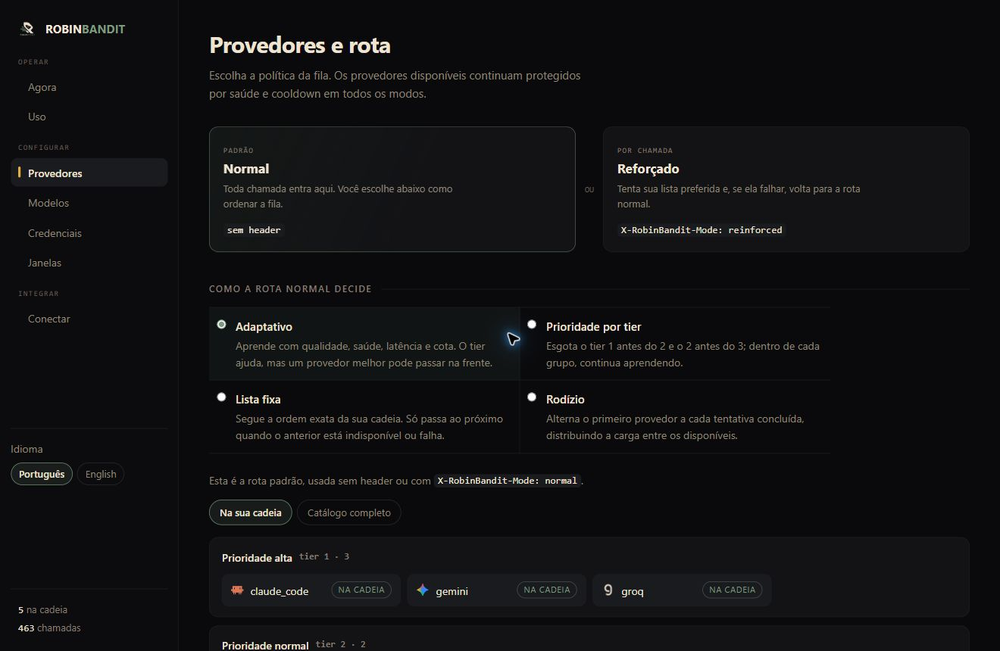
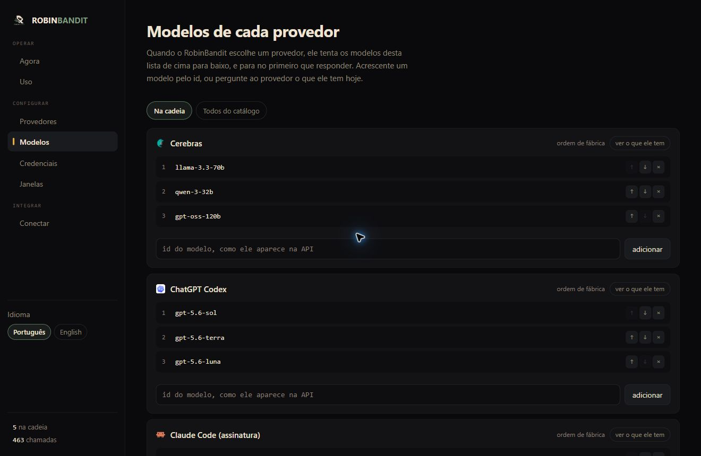
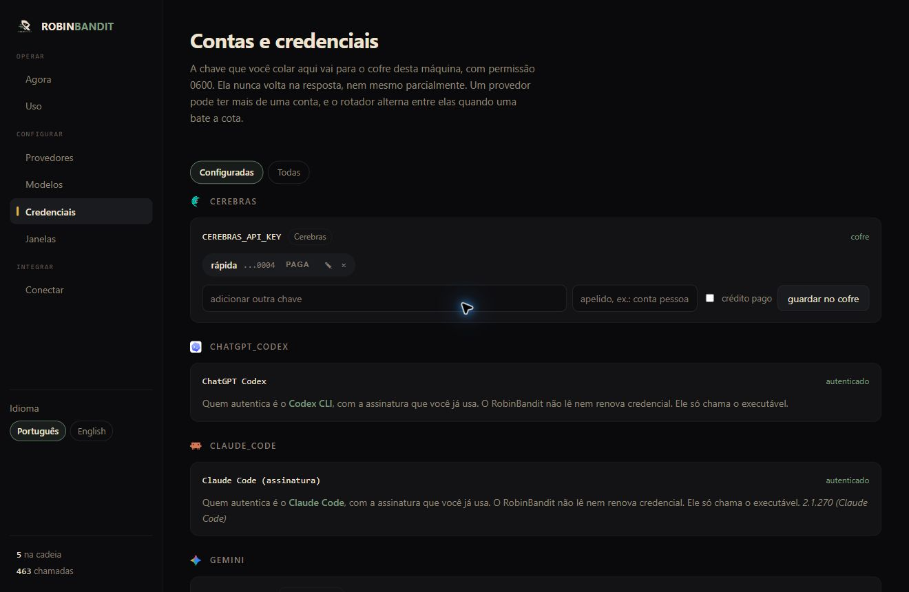
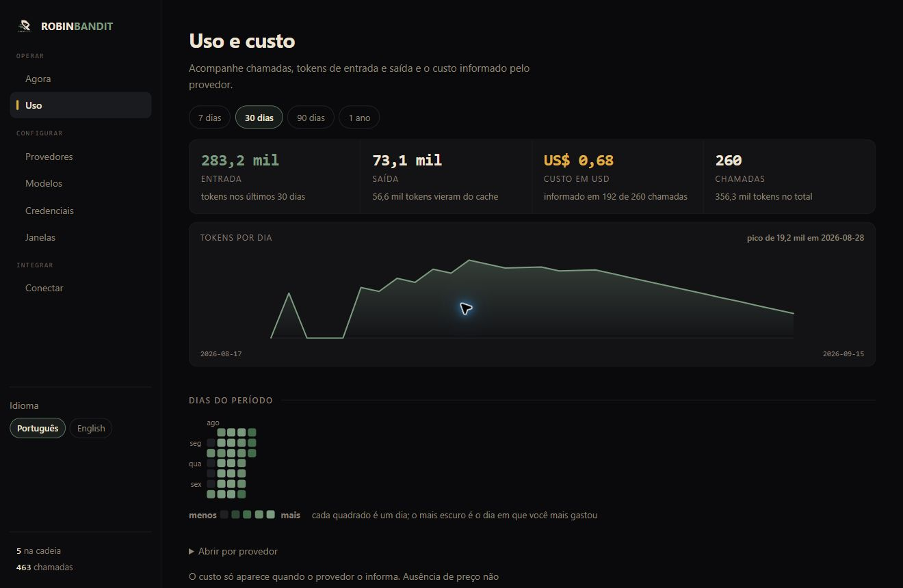
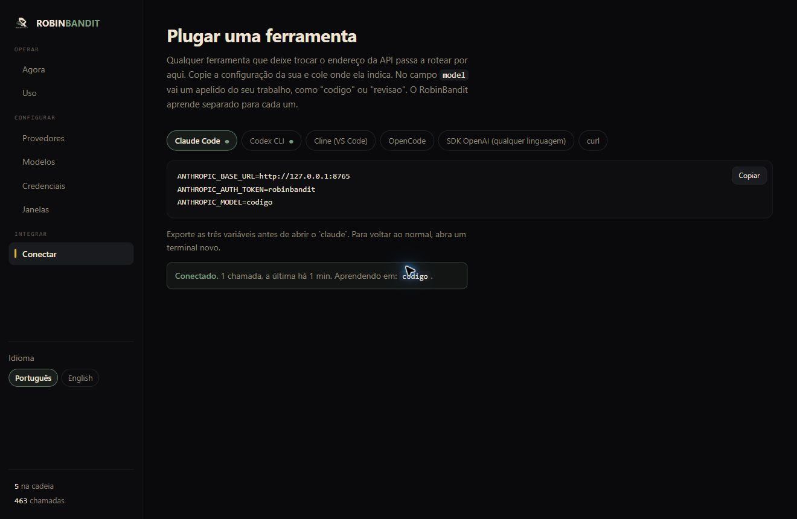

<p align="center">
  
</p>

<p align="center">
  <a href="https://github.com/Ryanleoncoder/RobinBandit/actions/workflows/ci.yml"></a>
  
  
  <a href="LICENSE"></a>
</p>

# RobinBandit

**Português** · [English](README.en.md)

Roteador adaptativo para múltiplos provedores de LLM. Ele fica entre o seu
agente e os provedores, e escolhe para onde mandar cada chamada com base no que
aconteceu nas anteriores.

```bash
pipx install "robinbandit[server,yaml,providers]"
robinbandit serve
```

Só isso. O painel abre sozinho no navegador. Claude Code e ChatGPT Codex entram
quando suas sessões de CLI já estão autenticadas; provedores por API só entram
com credencial, e serviços anônimos exigem ativação explícita. Sem `pipx`?
`pip install` funciona igual.

Depois, na aba **Conectar**, o painel entrega a configuração pronta para colar
no Claude Code, Codex, Cline, OpenCode, SDK da OpenAI ou curl.

**41 provedores prontos no catálogo**: 13 com free tier, 4 locais, 2 por
assinatura e o resto por chave. Estar no catálogo não é estar na sua cadeia:
sem credencial ou uma escolha explícita, o provedor fica de fora.

**[Ver a página do projeto →](https://ryanleoncoder.github.io/RobinBandit/)**



<p align="center"><sub>O painel em <code>/painel</code>: a ordem de agora e o motivo dela.</sub></p>

Em vez de manter uma ordem fixa de fallback, o RobinBandit observa o resultado das chamadas anteriores e reordena os provedores conforme contexto, qualidade, latência, disponibilidade e cota.

O projeto nasceu no [CX-GAME](https://github.com/Ryanleoncoder/CX-GAME), como roteador de provedores do Logun, e depois foi separado em um pacote próprio.

## Índice

**Entender** · [O problema](#o-problema) · [Como decide](#como-decide) ·
[Contexto](#contexto) · [Saúde e qualidade](#saúde-e-qualidade) ·
[Cold start](#cold-start) · [Como ele aprende, em detalhe](docs/como-aprende.md)

**Usar** · [Uso](#uso) · [Configuração YAML](#configuração-yaml) ·
[Credenciais](#credenciais-e-secrets) · [Painel](#painel) ·
[Três protocolos](#três-protocolos-um-router) · [CLI](#cli)

**Sem chave de API** · [ChatGPT Codex](#chatgpt-codex-oauth) ·
[Claude Code](#claude-code-assinatura)

## O problema

Uma cadeia tradicional costuma funcionar assim:

```text
Provider A → falhou → Provider B → falhou → Provider C
```

Se o primeiro provedor começa a devolver `429`, fica lento ou degrada, ele continua sendo o primeiro da fila na próxima chamada.

E dia ruim não é hipótese:



Nenhum desses provedores está quebrado. Os quatro passam de 97%. O ponto é que
a falha não é distribuída por igual: ela se concentra em dias, com motivo
(`429 rate limit`, `529 overloaded`), e num deles o `gemini` era a pior escolha
possível enquanto o `groq` ia a 100%. Uma ordem fixa não tem como saber disso.

Aqui os inimigos são **cota, custo, latência e degradação de qualidade**.

O objetivo é evitar insistir em provedores que já estão mostrando sinais de degradação e, entre os disponíveis, favorecer os que vêm respondendo melhor.

## Como decide

A captura acima é essa decisão acontecendo. `groq` tem 140 chamadas boas e 6
erros, `claude_code` tem 58 e 1. Os dois estão **em espera**, e a coluna
*por quê* diz por quanto tempo ainda (265.8s e 27.8s). Quem assumiu o primeiro
lugar foi `cerebras`, com 31 chamadas, 0 erros e 324ms.

Ninguém editou a configuração para isso acontecer. É a diferença entre um
roteador e uma lista de fallback: na lista, `groq` continuaria sendo o primeiro
da fila na próxima chamada.

A cada chamada de `order()`, cada provedor recebe um score:

```python
score = w_q * qualidade_thompson
      + w_l * (1 - latencia_norm)
      + w_s * saude_thompson
      + bonus_tier
      + bonus_prioridade
      + bonus_perfil
      - penalidade_de_custo
      - penalidade_de_cota
      - penalidade_de_ocupacao
```

Os sinais usados são:

* **qualidade:** Thompson Sampling por `(contexto, provedor)`;
* **latência:** Peak EWMA;
* **saúde:** Thompson Sampling Beta separado da qualidade;
* **cota:** quando o provedor informa quanto ainda resta;
* **ocupação:** número de chamadas abertas;
* **tier:** preferência econômica declarada;
* **prioridade:** preferência explícita do YAML;
* **custo:** penalidade configurável por `cost_class`;
* **perfil:** preferência por tarefa (`analysis`, `coding`, etc.).

Provedores em cooldown vão para o fim da fila, mas continuam disponíveis caso os demais também falhem.

### Peak EWMA

A latência usa Peak EWMA, na mesma linha de sistemas como Envoy e Finagle.

Um pico afeta o score imediatamente. A recuperação acontece de forma gradual, amostra por amostra.

### Concorrência

`begin()` e `end()` mantêm o número de chamadas abertas por provedor.

A ocupação entra como uma penalidade pequena e limitada, com saturação em `0.15`. Ela serve para ajudar na distribuição entre provedores comparáveis, sem transformar o router em um balanceador uniforme.

Em um teste com 24 chamadas concorrentes e 3 provedores equivalentes, o maior pico observado caiu de 10 para 9 chamadas simultâneas por provedor. O ideal, em uma distribuição perfeitamente uniforme, seria 8.

Quando um provedor é claramente melhor, o tráfego ainda tende a se concentrar nele.

RobinBandit não implementa bulkhead nem limite rígido de concorrência por provedor.

## Contexto

O contexto é uma string usada para separar células de aprendizado.

```python
await chain.complete(messages, context="auditoria")
await chain.complete(messages, context="autocomplete")
```

No modo universal o contexto é opaco. No `agent_mode: sentury`, a fachada
combina perfil e complexidade (por exemplo, `coding:CRITICAL`).

Você pode usar tipo de tarefa, idioma, tenant, tier ou qualquer outra classificação que faça sentido para sua aplicação.

Sem contexto, tudo cai na célula `default`, funcionando como um bandit global por provedor.

Os pesos também podem variar por contexto:

```python
router = ProviderRouter(
    priors,
    weights={
        "auditoria": (0.60, 0.15, 0.25),
        "autocomplete": (0.20, 0.50, 0.30),
    },
)
```

A ordem dos pesos é:

```text
(qualidade, latência, sucesso)
```

O padrão é:

```python
(0.40, 0.30, 0.30)
```

Thompson Sampling entra como um dos componentes do score. Latência, sucesso, cota e ocupação continuam participando da decisão.

## Saúde e qualidade

Na coluna *Qualidade* da captura acima, quem já rodou mostra número aprendido
(`cerebras` 0.72, `cohere` 0.68) e quem nunca rodou mostra o prior marcado como
**palpite**. Sem feedback, a coluna reflete saúde operacional; com
`reward_quality`, passa a refletir qualidade avaliada.

Uma chamada com HTTP `200` pode ter produzido uma resposta ruim.

Por isso existem dois canais de feedback:

```python
router.record_success(provider)
router.record_failure(provider)

router.reward_quality(
    provider,
    context="auditoria",
    good=True,
)
```

`record_success` e `record_failure` registram saúde operacional.

`reward_quality` registra avaliação da resposta.

Os canais usam distribuições Beta independentes. Um HTTP 200 nunca aumenta
`quality_mean`, e um feedback do revisor nunca altera `health_mean`.

O significado de “boa resposta” fica a cargo de quem usa o router. O feedback pode vir de um revisor, teste automático, usuário ou outro componente da aplicação.

Se `reward_quality` não for usado, o aprendizado continua apenas com os sinais operacionais.

## Recência

Antes de cada reforço, a célula aplica:

```python
decay = 0.99
```

A massa acumulada também possui limite.

Com isso, observações antigas perdem influência gradualmente e mudanças recentes começam a afetar o roteamento.

## Cold start

Uma célula nova começa usando o `quality` definido no prior do provedor, com massa equivalente a aproximadamente seis observações.

```python
providers = {
    "groq": {"tier": 1, "quality": 0.75},
    "gemini": {"tier": 1, "quality": 0.80},
}
```

Sem `quality`, o valor inicial é `0.6`.

Isso permite que provedores novos participem do roteamento mesmo sem histórico.
No painel, esses provedores aparecem com a qualidade marcada como **palpite**
até a primeira chamada real.

> Não é rede neural: é aprendizado por reforço bayesiano, sem `torch`, `sklearn`
> ou `numpy`. O porquê dessa escolha, com os trechos de código de cada
> mecanismo, está em **[docs/como-aprende.md](docs/como-aprende.md)**.

## Uso

```python
from robinbandit import ChainProvider, ProviderRouter

router = ProviderRouter(
    providers={
        "groq":   {"tier": 1, "quality": 0.75},
        "gemini": {"tier": 1, "quality": 0.80},
        "demo":   {"tier": 9, "quality": 0.05},
    },
    last_resort="demo",
)

chain = ChainProvider(
    [groq, gemini, demo],
    router,
)

response = await chain.complete(
    messages,
    context="auditoria",
)
```

### Seleção por request

O Router suporta três políticas sem confundir escolha com fallback:

```python
from robinbandit import RouteSelection

RouteSelection.router()                  # Router decide tudo
RouteSelection.hybrid("groq:model-a")   # tenta o fixado; depois volta ao Router
RouteSelection.strict("groq:model-a")   # somente o fixado; falha sem fallback
```

No perfil Sentury, `router`, `reforçado` e `dedicado` são aliases desses três
comportamentos. Na API universal, os nomes canônicos são `router`, `hybrid` e
`strict`; `auto` é aceito somente como alias legado de `router`.

Clientes HTTP genéricos podem pedir a fila Reforçado configurada no painel com
`X-RobinBandit-Mode: reinforced`. A fila aceita várias contas em ordem e pode
misturar assinaturas, créditos e contas gratuitas. Se todas falharem, o Router
continua pela cadeia normal. Dedicado fica intencionalmente específico do
Sentury. A decisão e os limites estão em
**[docs/selecao-por-chamada.md](docs/selecao-por-chamada.md)**.

## Configuração YAML

Instale `robinbandit[yaml,providers]` e carregue uma fachada configurada:

```python
from robinbandit import RobinGateway

gateway = RobinGateway.from_yaml("config/universal.yaml")
```

`agent_mode: universal` mantém o contexto inteiramente sob controle do agente.
`agent_mode: sentury` entende `complexity` e `profile` e os combina numa célula
como `analysis:CRITICAL`. Provedores, tiers, prioridades, classes de custo,
modelos e referências a variáveis de chave ficam no YAML; segredos nunca ficam.
Veja `config/universal.example.yaml` e `config/sentury.yaml`.

Desde a versão 0.4, `tier`, `quality`, `priority`, `cost_class`, perfis e modelos
entram na decisão. Saúde/cooldown/cota são aprendidos por provedor; qualidade,
latência e falhas são aprendidas por `provider:model`.

O YAML é executável: `build_provider_set(config, settings)` monta Groq, Gemini,
OpenRouter, Anthropic e qualquer endpoint OpenAI-compatible declarado. O
`settings` é opcional e funciona apenas como fonte de valores do `.env`; o
Robin não importa nenhum tipo do agente consumidor.

Contas extras também podem ficar em `accounts.items`, sempre usando `key_env`
em vez do valor da chave. No painel, Reforçado é uma lista ordenada de contas
tentadas antes da rota normal. `accounts.tiers` preserva os alvos legados do
Sentury; uma escolha gravada pelo painel é uma camada mutável por cima do YAML
e passa a valer na chamada seguinte.

### Credenciais e secrets

O YAML nunca contém a chave. `api_key_env` aponta para o nome permitido e o
resolvedor usa a precedência **o que o chamador passou > cofre > ambiente**.
Quem monta o provedor com um `settings` na mão escolheu aquele valor; o
ambiente é o padrão de quem não escolheu nada. Com o ambiente na frente, um
`.env` carregado no processo sobrescrevia em silêncio a configuração explícita. O cofre grava de
forma atômica, tenta aplicar permissão `0600`, suporta pools CSV/lista e nunca
devolve o valor em payloads de status. Use `ROBINBANDIT_VAULT_PATH` (universal)
ou o alias compatível `SENTURY_VAULT_PATH`.

O catálogo, o cofre e as escolhas de conta pertencem ao próprio RobinBandit.
Reforçado sem credencial registra a falha do alvo e continua pelo Router;
Dedicado sem credencial termina sem fallback. Alterar uma chave reconstrói os
adaptadores do Sentury sem exigir reinício.

#### ChatGPT Codex (OAuth)

O adapter `codex_app_server` é a exceção intencional ao modelo de `api_key_env`:
ele usa o CLI oficial como dono da sessão OAuth e fala com `codex app-server`
por JSONL. O Robin não abre `auth.json`, não copia access/refresh tokens e não
grava a sessão no seu cofre.

```bash
npm install -g @openai/codex
codex login
codex login status
```

Com o CLI autenticado, `build_provider_set()` inclui `chatgpt_codex`
automaticamente. Sem CLI ou login, ele fica fora da cadeia como qualquer
provedor não configurado. `CODEX_BINARY` permite escolher outro executável e
`CHATGPT_CODEX_MODELS` sobrescreve por CSV a ordem declarada no YAML.

Cada completion usa thread efêmera, sandbox read-only, aprovação `never` e
desabilita shell, plugins, apps, browser, computador, imagem e subagentes. Isso
mantém o Codex como modelo do Robin; ferramentas e efeitos continuam sob o
controle do agente hospedeiro. O catálogo mostra apenas `auth_type: codex_cli`
e o estado configurado, nunca material de autenticação.

O mesmo Codex pode ser cliente e provedor sem formar um ciclo. A configuração
normal do cliente continua apontando para o RobinBandit; o `app-server` que sai
como provedor recebe `model_provider="openai"` somente naquele processo. O
arquivo principal em `~/.codex/config.toml` não é reescrito. Essa sobreposição
por `-c` faz parte da [configuração oficial do Codex](https://learn.chatgpt.com/docs/config-file/config-reference).

O campo YAML `icon: openai` é apenas um identificador semântico. O agente
hospedeiro é dono do asset visual e decide como apresentá-lo; o Robin não fica
acoplado ao frontend do Sentury nem impõe imagem a integrações universais.

#### Claude Code (assinatura)

O adapter `claude_code` segue o mesmo princípio do Codex: o CLI oficial é o dono
da sessão, e o Robin nunca abre `~/.claude/.credentials.json`.

```bash
npm install -g @anthropic-ai/claude-code
claude          # login na primeira vez
claude --version
```

O binário também é encontrado dentro da extensão do editor
(`~/.vscode/extensions/anthropic.claude-code-*/resources/native-binary/`), que é
onde ele fica quando você usa o Claude Code pelo VS Code sem instalar o pacote
global. `CLAUDE_CODE_BIN` aponta para outro executável;
`CLAUDE_CODE_MODELS` sobrescreve a lista por CSV.

Cada chamada roda com `--allowed-tools ""`: aqui o Claude Code é provedor de
modelo, e o loop de ferramentas continua sendo do agente hospedeiro. Dois loops
no mesmo turno disputariam a mesma execução.

O que isso destrava é o trabalho pesado, como contexto de 1M e raciocínio
longo, sem chave de API e sem cota por token, pela assinatura que você já paga.



<p align="center"><sub>Assinatura não fica lenta quando o uso acaba: ela para, e volta numa hora que dá para saber.</sub></p>

Assinatura não tem cota por token para consultar; tem bloco. A aba *Janelas*
mostra quanto falta para o bloco de cada uma virar, quantas chamadas já foram
nele e quantas vezes ele parou por limite. É o suficiente para decidir entre
esperar e trocar de provedor. Repare que não existe campo de chave em nenhum
dos dois cards.

Bater esse limite **não** piora o provedor no ranking: o bloco acabar não é o
provedor degradando, então a saúde fica intacta e o cooldown espera exatamente
até a janela virar.

Um provider precisa implementar:

```python
async def complete(messages, temperature):
    ...
```

Também pode expor:

```text
name
last_model
last_quota
```

Se `complete()` aceitar `context`, o `ChainProvider` repassa o valor.

A assinatura é detectada com `inspect.signature`. Isso evita tratar um `TypeError` gerado dentro do provider como incompatibilidade de assinatura e repetir a chamada.

### `last_resort`

Um provider definido como `last_resort` permanece no fim da cadeia.

Ele também não acumula evidência de qualidade no bandit.

É útil para fallbacks locais ou providers usados apenas como último recurso.

## Painel

```bash
robinbandit serve          # sobe o endpoint
# abra http://localhost:8000/painel
```

Uma página, servida pelo próprio pacote. Mostra a ordem de agora e **por que**
ela está assim: qualidade, taxa de sucesso, latência e o motivo de quem está
em espera. Não calcula nada: tudo vem do router, porque um painel que faz a
própria conta mostra uma coisa enquanto o roteador decide por outra.

São sete abas. O que cada uma resolve:

### Provedores: escolha a política da fila



Tier é um grupo, e vários provedores cabem no mesmo. A tela oferece quatro
políticas de roteamento:

* **Deixar ele aprender** (`strategy: adaptive`): o tier é um bônus. Um
  provedor do tier 2 que vem respondendo melhor passa na frente do tier 1.
* **Meu tier manda** (`strategy: tier`): o tier é barreira. O tier 2 só é
  tentado quando o tier 1 inteiro falhou: *"vá nestes primeiro, mesmo que
  falhem; só depois gaste meus créditos"*.
* **Lista fixa** (`strategy: fixed`) respeita a ordem editável da cadeia e só
  passa ao próximo depois de indisponibilidade ou falha.
* **Rodízio** (`strategy: round_robin`) alterna a primeira tentativa depois de
  cada chamada real. Abrir o painel não move o cursor.

Arrastar muda de grupo; o botão tira e devolve à cadeia.

### Modelos: a lista de cada provedor



Escolhido o provedor, ele tenta os modelos desta lista de cima para baixo e
para no primeiro que responder. `GET /modelos/{provedor}` pergunta ao provedor
o que ele tem hoje, em vez de confiar numa lista escrita meses atrás.

### Credenciais: a chave não volta na resposta



A chave colada aqui vai para o cofre da máquina com permissão `0600` e **nunca
volta em nenhum payload**, nem o começo, nem o fim. Um provedor pode ter mais
de uma conta, e o rotador alterna entre elas quando uma bate a cota. Reforçado
aceita várias contas em ordem, pagas ou gratuitas, antes de voltar à rota
normal. A interface universal não mostra Dedicado: o Sentury já controla essa
seleção na própria interface. A separação técnica está em
[seleção por chamada](docs/selecao-por-chamada.md).

*Trazer para o cofre* copia o que hoje só existe no ambiente; o `.env` de
origem não é tocado.

Os dados locais ficam separados por assunto em `~/.robinbandit/`:

| Arquivo | Conteúdo |
|---|---|
| `config.yaml` | ajustes pessoais do catálogo YAML |
| `cofre.json` | segredos, com permissão `0600` |
| `contas.json` | contas e a fila do Reforçado |
| `preferencias.json` | idioma, modo, cadeia, tiers e modelos escolhidos |
| `ranking.json` | aprendizado do roteador |
| `historico.json` | saúde diária dos últimos 60 dias |
| `uso.json` | tokens e custo informado dos últimos 365 dias |
| `janelas.json` | blocos de uso das assinaturas |

Uma instalação antiga que ainda mistura preferências em `contas.json` é
migrada automaticamente. O destino é gravado antes da cópia antiga ser limpa.
Nenhum desses arquivos vai para o repositório.

### Uso e custo



O painel separa tokens de entrada, saída e cache, mostra chamadas e mantém um
calendário de 365 dias. Custo em USD aparece quando o próprio provedor o inclui
na resposta. Sem preço informado, a tela diz isso em vez de mostrar `$0.00`.

Em tokens, e não em reais, de propósito. Preço muda por modelo, por região e
por promoção, e um custo calculado com tabela velha dá a confiança de um número
exato sobre um palpite desatualizado.

### Conectar: plugar uma ferramenta



`GET /cli-tools` devolve a configuração pronta para cada cliente apontar para
cá: Claude Code, Codex, Cline, OpenCode, SDK e curl. Nada é escrito no disco:
quem decide alterar a própria configuração é você.

O campo `model` vira o **contexto** do bandit, não o nome de um modelo:
`model="codigo"` aprende numa célula, `model="triagem"` em outra.

## Usando somente o router

`ChainProvider` não é obrigatório.

```python
ordered = router.order(context="auditoria")
```

Uma camada de execução própria pode usar essa ordem e depois alimentar o router:

```python
router.record_success(provider)

router.record_failure(provider)

router.reward_quality(
    provider,
    context="auditoria",
    good=True,
)
```

## Persistência

O estado aprendido pode ser serializado:

```python
state = router.dump()
```

E restaurado depois:

```python
router.load(state)
```

`dump()` retorna um dicionário compatível com JSON e pode ser salvo em arquivo, Redis, Upstash ou outro storage.

Cooldown, status atual e informações de cota não entram no dump porque representam estado temporário do processo.

Desde a versão 0.2, o dump possui mapas `health` e `quality` separados. O
`load()` aceita o formato 0.1 antigo com `cells`, migrando essas células para
`health`; a qualidade antiga era misturada e não pode ser reconstruída com
honestidade.

## Três protocolos, um router

O extra `server` expõe o router por três APIs, porque as ferramentas não falam
a mesma língua:

| rota | protocolo | quem fala |
|---|---|---|
| `POST /v1/chat/completions` | OpenAI Chat Completions | Cline, OpenCode, SDK da OpenAI, curl |
| `POST /v1/responses` | OpenAI Responses | Codex CLI |
| `POST /v1/messages` | Anthropic | Claude Code |

O Claude Code chama `/v1/messages`, com `system` em campo separado e `content`
em blocos. O Codex CLI atual chama `/v1/responses`, com itens, ferramentas e
eventos SSE próprios. As três rotas caem no mesmo `ChainProvider` e no mesmo
bandit; muda a tradução na entrada e na saída.

`/v1/messages` e `/v1/responses` aceitam `stream: true` e respondem na sequência
SSE de cada protocolo. O texto sai inteiro em um delta porque o `complete()` do
Robin devolve a resposta pronta. `/v1/responses` também traduz chamadas de
ferramenta normais e customizadas. `/v1/chat/completions` recusa streaming com
`400`.

### Endpoint OpenAI-compatible

O extra `server` expõe o router através de uma API compatível com clientes OpenAI.

```bash
pip install "robinbandit[server]"
pip install "robinbandit[yaml,providers]"
```

```python
from robinbandit.server import create_app

app = create_app(
    [groq, gemini, demo],
    router,
)
```

Execute com:

```bash
uvicorn app:app
```

Depois, aponte um cliente compatível para o endpoint:

```python
from openai import OpenAI

client = OpenAI(
    base_url="http://localhost:8000/v1",
    api_key="nao-usado",
)

response = client.chat.completions.create(
    model="auditoria",
    messages=[...],
)
```

O campo `model` é usado como contexto do bandit:

```text
model="auditoria" → contexto "auditoria"
model="triagem"   → contexto "triagem"
```

Isso permite separar células de aprendizado mesmo em clientes que não conhecem a API específica do RobinBandit.

Clientes que usam a camada OpenAI-compatible do Ollama também podem apontar para o mesmo endpoint.

## Feedback

O protocolo OpenAI não possui um campo padrão para feedback de qualidade.

RobinBandit adiciona um endpoint separado:

```text
POST /v1/chat/completions
        ↓
id: chatcmpl-abc

POST /feedback
{
  "id": "chatcmpl-abc",
  "good": true
}
```

O `id` associa o feedback à decisão que gerou aquela resposta, incluindo provedor e contexto.

O feedback pode chegar depois da resposta original.

Até 10 mil decisões podem permanecer aguardando feedback. Acima desse limite, as mais antigas são descartadas.

Sem `/feedback`, o endpoint continua aprendendo pelos sinais operacionais.

Também estão disponíveis:

```text
GET /v1/models
GET /state
```

### Limitações do servidor

O servidor não implementa:

* autenticação;
* gestão de chaves dos próprios clientes;
* budget;
* contagem universal de tokens.

É um proxy local, como as ferramentas ao lado das quais ele vive: o que protege
é escutar em `127.0.0.1`, não uma senha. Numa VPS, mantenha em localhost e
alcance o painel por túnel ssh (`ssh -L 8000:localhost:8000 usuario@host`).

Streaming token a token também não existe: `/v1/messages` e `/v1/responses`
embalam a resposta pronta nos eventos de seus protocolos, e
`/v1/chat/completions` recusa `stream: true` com `400`.

O campo `usage` é omitido quando o provider não fornece essa informação.

## CLI

O painel é para entender; a linha de comando é para fazer sem navegador, que é
o que um servidor precisa.

```bash
robinbandit serve                      # endpoint e painel; o navegador abre sozinho
robinbandit key add GROQ_API_KEY ...    # guarda uma chave no cofre
robinbandit key list                   # o que está configurado (nunca mostra o valor)
robinbandit providers                  # quem está na cadeia
robinbandit state estado.json          # o que o router aprendeu
robinbandit language en                # em que língua ele responde
```

`serve` detecta se há tela. Numa máquina sem sessão gráfica, como servidor,
container ou ssh, ele não tenta abrir navegador. `--no-browser` força isso em
qualquer lugar.

`key add` aceita `-` no lugar do valor para ler da entrada padrão, o que
mantém a chave fora do histórico do shell:

```bash
cat chave.txt | robinbandit key add GROQ_API_KEY -
```

`providers on X` e `providers off X` põem e tiram um provedor da
cadeia. Os dois gravam no mesmo arquivo que o painel grava, e valem no próximo
arranque.

`state` lê um arquivo no formato de `ProviderRouter.dump()` e mostra o estado
aprendido: contadores, latência, qualidade, número de amostras e os parâmetros
alpha/beta das células.

Em terminal interativo, o RobinBandit também mostra a logo em Braille.

```bash
robinbandit state estado.json --no-color
robinbandit state estado.json --no-banner
```

O nome do arquivo continua sendo aceito direto, sem subcomando
(`python -m robinbandit estado.json`), como era antes de `serve` existir.

Em pipes e redirecionamentos, o banner é omitido automaticamente.

## Desenvolvimento

```bash
pip install -e ".[dev]"
pytest
```

O core usa apenas a biblioteca padrão do Python.

Dependências adicionais ficam nos extras:

```bash
pip install "robinbandit[server]"
```

O servidor usa FastAPI e Uvicorn.

Os testes usam `pytest` e `pytest-asyncio`.

## Fora do escopo atual

RobinBandit agora é router e gateway de provedores. Ainda não implementa:

* bulkhead por provedor;
* rate limiter;
* autenticação de clientes no servidor OpenAI-compatible;
* teto monetário rígido com contabilização universal de tokens/preços;
* shadow routing.

O custo já participa da função objetivo por classe declarada, mas ainda não é
uma fatura exata por token. Usando o pacote diretamente, `reward_quality` aceita
provedor e modelo; no servidor, `/feedback` correlaciona reward atrasado pelo id
da resposta.

## Identidade

| Cor | Hex | Onde |
|---|---|---|
| Bege | `#EFE3D2` | a letra, o texto sobre fundo escuro |
| Verde | `#5E7A61` | as barras de velocidade, o "BANDIT" |
| Âmbar | `#E0AF43` | o olho, o único ponto de destaque |
| Preto | `#000000` | o fundo |

O logo em `assets/robinbandit_logo1.png` existe em versão para fundo escuro e
para fundo claro. O âmbar aparece uma vez só, de propósito: é o que o olho
procura primeiro.

## Licença

MIT. Veja [LICENSE](LICENSE).
